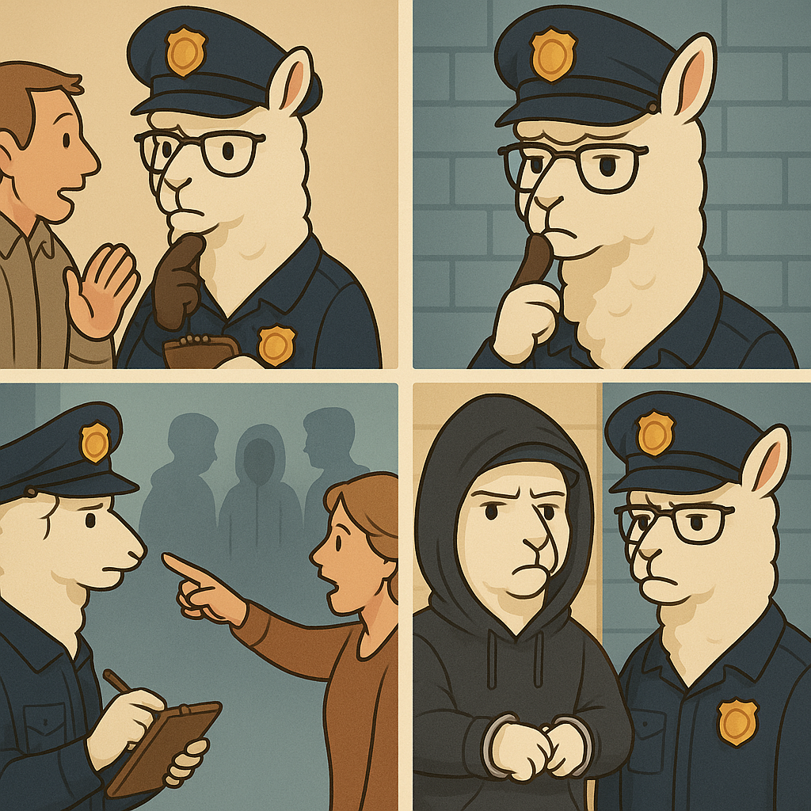

### LLaVA-ReID: Selective Multi-image Questioner for Interactive Person Re-Identification

[](https://arxiv.org/pdf/2504.10174) [](https://github.com/XLearning-SCU/LLaVA-ReID/blob/main/img/poster-wo-wechat.png)

<div align=center>

</div>
This is the official implementation of LLaVA-ReID: Selective Multi-image Questioner for Interactive Person Re-Identification (ICML 2025).


### 🔧 Getting Started
#### 1. Clone LLaVA-ReID
~~~
git clone https://github.com/XLearning-SCU/LLaVA-ReID.git
cd LLaVA-ReID
~~~

#### 2. Install Dependencies

~~~bash
conda create -n llava-reid python=3.10 -y
conda activate llava-reid

pip install --upgrade pip  # enable PEP 660 support
pip install -r requirements.txt
# Install FlashAttention (limit jobs to avoid memory issues)
MAX_JOBS=4 pip install flash-attn --no-build-isolation
~~~

#### 3. Prepare Dataset and LLaVA Model

Download annotation of [Interactive-PEDES](https://huggingface.co/datasets/XLearning-SCU/Interactive-PEDES-v1) and organize your dataset as follows:

~~~bash
tree -L 3
.
├── CUHK-PEDES
│   ├── caption_all.json
│   ├── imgs
│   │   ├── cam_a
│   │   ├── cam_b
│   │   ├── CUHK01
│   │   ├── CUHK03
│   │   ├── Market
│   │   ├── test_query
│   │   └── train_query
│   └── readme.txt
├── ICFG-PEDES
│   ├── ICFG-PEDES.json
│   └── imgs
│       ├── test
│       └── train
└── Interactive-PEDES_interactive_annos.json

13 directories, 4 files
~~~

Our server can connect to internet, Pre-download the following models to your project directory:

- [LLaVA-OneVision-Qwen2-7B-ov](https://huggingface.co/lmms-lab/llava-onevision-qwen2-7b-ov)
- and its vision encoder [SigLip](https://huggingface.co/google/siglip-so400m-patch14-384) to project folder:

~~~bash
├── LLaVA-ReID
│   ├── llava-onevision-qwen2-7b-ov
│   ├── siglip-so400m-patch14-384
...
~~~

Update `llava-onevision-qwen2-7b-ov/config.json`:
~~~json
{
    "_name_or_path": "/public/home/pengxi_lab/project/LLaVA-ReID/llava-onevision-qwen2-7b-ov",
    "image_aspect_ratio": "pad",
    "mm_vision_tower": "/public/home/pengxi_lab/project/LLaVA-ReID/siglip-so400m-patch14-384",
    "mm_spatial_pool_ratio": 2.0,
}
~~~


### 🚀 Training Pipeline
#### Step 1: Train Retriever

- Set the `stage` in `./config/Interactive-PEDES.yaml` to `train_retriever` 
- update the `data_dir` in `Interactive-PEDES.yaml` accordingly. 

Launch with SLURM:

~~~bash
sbatch slurm_launch.sh
~~~

Or directly:

~~~bash
CUDA_VISIBLE_DEVICES=0,1,2,3 \
torchrun --nproc_per_node=4 --nnodes=1 --node_rank=0 --master_addr=0.0.0.0 --master_port=9000 \
main_train.py --config_file=config/Interactive-PEDES.yaml
~~~

#### Step 2: Prepare Training Data for Quesitoner

Set the `stage` in `./config/Interactive-PEDES.yaml` to `prepare_data` and run again:
~~~bash
sbatch slurm_launch.sh
~~~

#### Step 3: Train Questioner

Set the `stage` in `./config/Interactive-PEDES.yaml` to `train_questioner`, then:
~~~bash
srun -p gpu4090_EU --gres=gpu:4 --cpus-per-task 16 -n1 --ntasks-per-node=1 --job-name=llava-reid \
torchrun  --nnodes=1 --nproc_per_node=4 --master_port=9000 train_llava_reid.py --config_file=config/Interactive-PEDES.yaml
~~~

#### Step 4: Warm-up Selector

Set the `stage` in `./config/Interactive-PEDES.yaml` to `warmup_selector` and run again:
~~~bash
sbatch slurm_launch.sh
~~~

#### Step 4: Joint Train Selector and Questioner

Set the `stage` in `./config/Interactive-PEDES.yaml` to `train_selector` and update `model_path` in `Interactive-PEDES.yaml`
~~~bash
srun -p gpu4090_EU --gres=gpu:4 --cpus-per-task 16 -n1 --ntasks-per-node=1 --job-name=llava-reid \
torchrun --nproc_per_node=4 --master_port=9000 train_llava_reid.py --config_file=config/Interactive-PEDES.yaml
~~~


### 📊 Evaluation

#### Launch SGLang Server

We use [SGLang](https://github.com/sgl-project/sglang) to accelerate the inference of Answerer. You need to install SGLang and launch a Qwen2.5-7B-Instruct server, for example:
~~~bash
CUDA_VISIBLE_DEVICES=4 python -m sglang.launch_server --model-path Qwen2.5/Qwen2.5-7B-Instruct --port 10500 \
--host "0.0.0.0" --mem-fraction-static 0.8 --api-key Qwen-7B
~~~

#### Update API Endpoint

Replace the base_url in /model/llava_reid.py:

~~~python
self.answer_model = AnswerGeneratorSGLang("http://192.168.49.58:10500/v1", "Qwen-7B")
~~~

#### Evaluate

~~~bash
CUDA_VISIBLE_DEVICES=0,1 python main_eval.py --config_file=config/Interactive-PEDES.yaml
~~~

We have upload our pretrained LLaVA-ReID checkpoint, you can download it on [BaiduCloud](https://pan.baidu.com/s/1nL5-lJ7kNiWce9r7LFyaaA?pwd=by2a), extract code `by2a`

### 📚 Citation
If this codebase is useful for your work, please cite the following papers:

```latex
@inproceedings{lullava2025,
  title={LLaVA-ReID: Selective Multi-image Questioner for Interactive Person Re-Identification},
  author={Lu, Yiding and Yang, Mouxing and Peng, Dezhong and Hu, Peng and Lin, Yijie and Peng, Xi},
  booktitle={Forty-second International Conference on Machine Learning}
  year={2025},
}
```


### ✨ Acknowledgements
Some components of this code implementation are adopted from: 

- [IRRA](https://github.com/anosorae/IRRA): Learning Fine-grained Relation for Text-to-Image Person Retrieval  (CVPR 2023)

- [LLaVA-NeXT](https://github.com/LLaVA-VL/LLaVA-NeXT): Excellent Open Large Multimodal Models

- [SGLang](https://github.com/sgl-project/sglang): A fast serving framework for large language models and vision language models